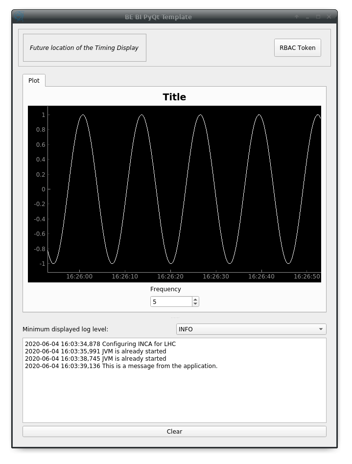
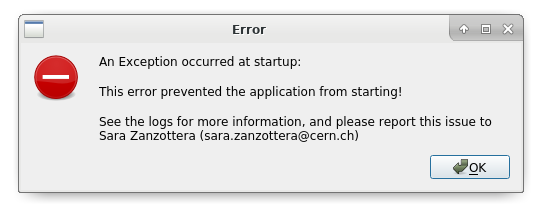

# SY-BI PyQt5 Template    &nbsp; &nbsp; &nbsp;   

This is the repository for the SY-BI PyQt5 Template code.

It can be used to bootstrap a PyQt GUI project: the code provides a basic
architecture that you only have to extend with your own interface and logic. 

It provides:
- A sane folder structure for your code, based on the MVP architecture.
- A test setup ready for unit tests and GUI tests (based on `pytest-qt`)
- A minimal simulation environment for your tests (based on 
[`papc`](https://gitlab.cern.ch/pelson/papc)), 
that can be extended to mimick your real data sources (FESA, NXCALS, ...)
- A `setup.py` to customize for quick packaging & release, with `entry_points`
- `.gitignore` with common Python artifacts
- `.gitlab-ci.yml` supporting GUI testing out of the box and coverage reports
- A small `activate.sh` activation script to activate both your virtualenv and Acc-Py, and
sets up some env vars for QtDesigner

See the [documentation](https://acc-py.web.cern.ch/gitlab/szanzott/pyqt-mega-tutorial-for-sy-bi/docs/master/fast/5-project-structure.html)
for a more detailed explanation of all the features.

## Getting started

#### Install
Assuming you have access to `bipy-gui-manager` ([see here](https://gitlab.cern.ch/bisw-python/bipy-gui-manager)),
type:
```
bipy-gui-manager new
```
This will start a wizard that will give you a customized copy of this template.

#### Start
The application can already be started. To start it, type in the console the name of your project
(the one you gave to `bipy-gui-manager` while creating the project).

You should see the frame with a dummy application in the center, like this:



Or a smaller window with an error. In the latter case, please report the error 
to the maintainers.



To obtain an empty template (without the demo application), type:
```
bipy-gui-manager new --no-demo
```

-------------------------------

## Contribute
If you are a developer and want to contribute, or you're taking over this project:

#### Setup
Do the following every time you begin working:
```
cd <your project's name>/
git pull
source activate.sh
```

Also, please keep this README up-to-date :)
