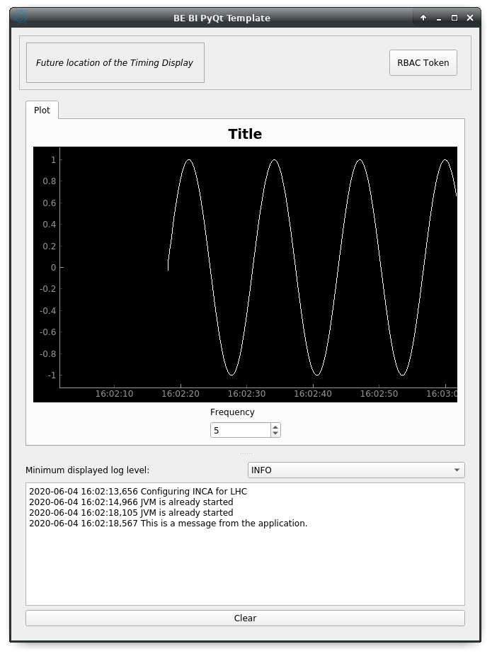

# BE-BI PyQt5 Template

This is the repository for the BE-BI PyQt5 Template code.

It can be used to bootstrap a PyQt GUI project: the code provides a basic
architecture that you only have to extend with your own interface and logic. 

It provides:
- A sane folder structure for your code, based on the MVP architecture.
- A test setup ready for unit tests and GUI tests (based on `pytest-qt`)
- A minimal simulation environment for your tests (based on 
[`papc`](https://gitlab.cern.ch/pelson/papc)), 
that can be extended to mimick your real data sources (FESA, NXCALS, ...)
- A `setup.py` to customize for quick packaging & release, with `entry_points`
- `.gitignore` with common Python artifacts
- `.gitlab-ci.yml` supporting GUI testing out of the box and coverage reports
- A small `activate.sh` activation script to activate both your virtualenv and Acc-Py, and
sets up some env vars for QtDesigner

See below for a more detailed explanation of all the features.

## Getting started

#### Install
Assuming you have access to `bipy-gui-manager` ([see here](https://gitlab.cern.ch/bisw-python/bipy-gui-manager)),
type:
```
bipy-gui-manager create-project
```
This will start a wizard that will give you a customized copy of this template.

#### Start
The application can already be started. To start it, type in the console the name of your project
(the one you gave to `bipy-gui-manager` while creating the project).

You should see the frame with a dummy application in the center, like this:



Or a smaller window with an error. In the latter case, please report the error 
to the maintainers.

To obtain an empty template (without the demo application), type:
```
bipy-gui-manager create-project --no-demo
```

## Usage
This code base is meant to be used as a boilerplate to get you started on a new Python GUI.
Here is a description of what every file does and when/how you are encouraged to modify it.

#### `.gitignore`
Typical .gitignore file that excludes most Python artifacts. You can add your
own files/folders to exclude them from version control.

#### `.gitlab-ci.yml`
This file configures GitLab CI to run your tests each time you push your code
to the repository.

It differs a lot from the default obtained by executing 
`acc-py init ci`, because it has been configured to:

1. Run headless GUI tests with `pytest-qt`
2. Provide a coverage report that you can use as a repository badge.
3. Do not deploy automatically on the CERN Python repository 

You can  modify it to add more tasks, deploy automatically, do linting,
or anything else.

#### `activate.sh`
Small bash script sourcing, in order, Acc-PyQt and your virtualenv (assuming 
it's called `venv` and lives in the current directory). It also sets the 
`PYQTDESIGNERPATH` in case you want to use QtDesigner with the 
[`accwidget`](https://gitlab.cern.ch/acc-co/accsoft/gui/accsoft-gui-pyqt-widgets)'s
plugin.

#### `README.md`
This README file. Please populate it meaningfully, including at the minimum some
information about what your project is, how to execute it, who's 
the author/maintainer and any precautions to take when running/debugging 
(is this GUI operational?)

NOTE: `pyqt-manager` will create you a standard README.ms with some basic information.
You're still encouraged to expand it with a meaningful description of your project's
goals and functionalities.

#### `setup.py`
This is the file that define your application as a Python package. You're 
strongly encourage to develop your projects as packages instead of simple
script, for easier maintainability and deployment.

You can learn more about Python packaging in 
[here](https://packaging.python.org/).

NOTE: `pyqt-manager` will partially populate this file with proper values,
but you're always free to modify it, especially to add your project's dependencies.

#### `be_bi_pyqt_template/main.py`
Application's entry point. You can edit the main function to load your GUI, 
as specified in the comments of the file itself, but this file should contain 
no more than the small function that starts the event loop (and at most do
some error handling). The rest of the logic will go in the other folders.

In the demo application, `ExampleWidget` is instantiated and loaded here.

#### `be_bi_pyqt_template/widgets`
This contains the components of your application. In an MVP model, these are 
the Presenters: instantiate the Views (see `be_bi_pyqt_template/resources`)
and wire them to the Models (see `be_bi_pyqt_template/models`),
acting as an intermediary when required.

In the demo application, `ExampleWidget` lives in there.

#### `be_bi_pyqt_template/resources`
This folder contains multiple entities, all related to the static GUI's
structure definition. These represent the View from an MVP perspective. 

They are:

- `*.ui` files. These are generated by QtDesigner and are XML files describing 
your GUI's layout, with no logic.
- Subfolders like `images` containing static resources (PNG, GIF, etc...) 
and `*.qrc` files. These files are Qt's Resource files and are used to load 
static files, like images and icons, into the GUI.
- A Subfolder called `generated`, that contains generated code of two kinds:
    - `ui_*.py` files. These files are generated by `pyuic5` basing on the `*.ui`
file with matching name. NEVER MODIFY THESE FILES: they contain generated
code and every modification will be erased at the next run of `pyuic5`.
    - `*_rc.py` files. These are generated by `pyrcc5` basing on the `*.qrc` files
present in the `images` folder with a matching name. NEVER MODIFY THESE FILES: 
they contain generated code and every modification will be erased at the next
run of `pyrcc5`.

_More instruction on how to use pyuic5 and pyrcc5 (potentially with pyqt5ac) coming soon_

In this folder, you should modify the `*.ui` and `*.qrc` files only with 
QtDesigner (unless you *really* know what you're doing) and load the Views 
into the Presenters (`/widgets/` folder) by importing the `ui_*.py` files from
the `generated` folder.

#### `be_bi_pyqt_template/models`
This folder contains the Models of your application. The Model manages any 
object connecting to the control system, like PyJAPC instances, 
NXCALS connections, etc...

Models should send their data to the Views by emitting Signals that match
corresponding Slots in the View or Presenter.

In the demo application, you can see how the `ExampleModel` class does mostly
PyJapc SET operations, while the plots' models retrieve data.

#### `be_bi_pyqt_template/models/papc_setup`
This folder contains a barebone papc setup to sandbox your application. `papc`
is a library that can trick you application into believing it's connecting to
the control system, while it's receiving simulated data instead. This also
allows control system apps to run in a sandbox also on non-TN machines, without
the need of any modification.

`papc` is also an interesting option for meaningful and thorough GUI tests. Read
more about it on the 
[Acc-Py wikis](https://wikis.cern.ch/display/ACCPY/papc+-+a+pure+Python+PyJapc+offline+simulator).

#### `tests`
This folder contains the automated tests for your app. It already contains some
basic tests to ensure your setup is correct, and they will be run on GitLab CI
every time you push code to your repository. 

In this case, it tests the demo application, making sure the SET command
have an actual effect on the simulated device, and other things.

You can run your tests locally by executing:
```
python -m pytest
```

To see the coverage report, type:
```
python -m pytest --cov=<your project's name>
```

If the tests hang, probably Qt is swallowing errors without exiting. Note that
this can happen for the same reasons on GitLab CI. To see the stacktrace,
re-run the tests as:
```
python -m pytest --vv --log-cli-level=DEBUG
```

-------------------------------

## Contribute
If you are a developer and want to contribute, or you're taking over this project:

#### Setup
Do the following every time you begin working:
```
cd <your project's name>/
git pull
source activate.sh
```

Also, please keep this README up-to-date and useful :)
